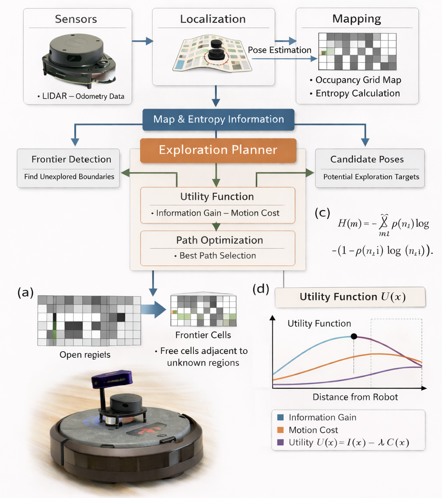

# Milestone 1: Yalo Mobile Robot

{: .no_toc }


Team members: Yibo @JerrySyameimaru, Achyut @achyutsun, Long @lhtruong26

Arizona State University RAS-598 Mobile Robotics Class

Professor: Vivek Thangavelu, PhD

---

## Table of Contents

{: .no_toc .text-delta }

1. TOC
{:toc}

---

## 1. Mission Statement & Scope: 
Yalo is a Mobile Robot. Yalo robot when entering the new environment with the information from LiDAR the Frontier detection, Entropy Exploration Algorithm maps the environment and navigates towards the target destination 

---

## 2. Technical Specifications

**Robot Platform:** TurtleBot 4
**Kinematic Model:** Differential Drive
**Perception Stack:** LiDAR, RGB-D, IMU

Below is a snippet of the Python code used to process the assignment data.

```python
utility function. U(x) = I(x) -C(x), where (x) is expected mutual information and C(x) is motion cost. 

```

---

## 3. High-Level System Architecture

You can include images by placing them in the `assets/images/` folder.


*Fig. 1 | Architecture Diagram
Illustration of the information gain exploration architecture for a 2D Turtlebot [a] System architecture integrating sensing, localization, mapping, and planning. [b] Entropy formulation for occupancy grid maps. [c] Frontier detection, where frontier cells are free cells adjacent to unknown regions. [d] Utility optimization maximizing expected information gain through the utility function. U(x) = I(x) -C(x), where (x) is expected mutual information and C(x) is motion cost. *

---

## 4. Safety & Operational Protocol

* [x] Complete Markdown documentation
* [x] Verify LaTeX rendering
* [x] Generate Mermaid flowchart
* [ ] Peer review feedback

---
      
## 5. Git Infrastructure

# Markdown Features

## Callouts
> This is a note
{: .note }

> This is a warning
{: .warning }

## Buttons
[Main Button](assignment1.html){: .btn .btn-primary }
[Blue Button](assignment2.html){: .btn .btn-blue }
[Blue Button](assignment3.html){: .btn .btn-red }

## Tables

| Header | Header |
| :--- | :--- |
| Cell | Cell |

---
