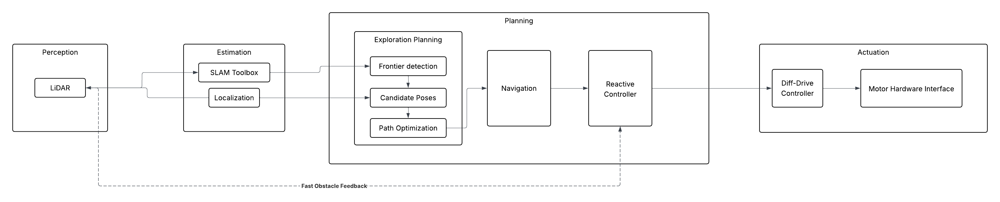

# Milestone 1: Yalo Mobile Robot

{: .no_toc }


Team members: Yibo @JerrySyameimaru, Achyut @achyutsun, Long @lhtruong26

Arizona State University RAS-598 Mobile Robotics Class

Professor: Vivek Thangavelu, PhD

---

## Table of Contents

{: .no_toc .text-delta }

1. TOC
{:toc}

---

## 1. Mission Statement & Scope: 
Yalo is a Mobile Robot. Yalo robot when entering the new environment with the information from LiDAR the Frontier detection, Entropy Exploration Algorithm maps the environment and navigates towards the target destination. 

The Yalo mobile robot is designed to autonomously explore and navigate previously unknown environments using LiDAR-based perception and information-theoretic exploration algorithms. By integrating frontier detection, entropy-driven exploration, and autonomous navigation, Yalo incrementally constructs a spatial representation of its surroundings while efficiently moving toward designated target destinations.

The system leverages real-time LiDAR sensing and odometry data to identify unexplored regions of the environment. Using a frontier-based exploration strategy, the robot detects boundaries between known and unknown space within the occupancy grid map. These frontiers serve as candidate exploration goals.

---

## 2. Technical Specifications

**Robot Platform:** TurtleBot 4

**Kinematic Model:** Differential Drive

**Perception Stack:** LiDAR, RGB-D, IMU

Utility function, where (x) is expected mutual information and C(x) is motion cost.

```python
U(x) = I(x) -C(x) 

```

---

## 3. High-Level System Architecture

Mermaid Diagram




*Fig. 1 | Architecture Diagram
Illustration of the information gain exploration architecture for a 2D Turtlebot [a] System architecture integrating sensing, localization, mapping, and planning. [b] Entropy formulation for occupancy grid maps. [c] Frontier detection, where frontier cells are free cells adjacent to unknown regions. [d] Utility optimization maximizing expected information gain through the utility function. U(x) = I(x) -C(x), where (x) is expected mutual information and C(x) is motion cost. *

---

### Module Declaration Table: 
| Module / Node | Functional Domain | Software Type | Description |
| --- | --- | --- | --- |
| **LiDAR** | Perception | **Library** | Ingests raw distance and image data from the hardware. |
| **SLAM Toolbox** | Estimation | **Library** | Generates the 2D occupancy grid for environmental mapping. |
| **Robot Localization** | Estimation | **Library** | Standard EKF to fuse wheel odometry and IMU data. |
| **Exploration Planner** | Planning | **Custom** | A custom implementation of Frontier detection, Candidate poses and Path optimization |
| **Nav2 Global Planner** | Planning | **Library** | Calculates the long-distance path through the known map. |
| **Reactive Controller** | Planning | **Custom** | A custom implementation of the Dynamic Window Approach (DWA) to handle moving obstacles in real-time. |
| **Diff-Drive Controller** | Actuation | **Library** | Translates velocity commands into wheel rotations. |
| **Motor Hardware Interface** | Actuation | **Custom** | Low-level serial communication logic to interface with the motor encoders. |

---

### Module Intent: 
#### Library: 
        The motion of the is controlled by Create3 controller which subscribes on the /cmd_vel topic. Turtlebot's builtin turtlebot4_navigation will be considered for Nav2 Global Planning. The turtlebot4_navigation library is the primary software framework used by the TurtleBot 4 platform to perform autonomous navigation in mapped or partially known environments. It is built on top of the Robot Operating System 2 (ROS 2) ecosystem and leverages the Nav2 Navigation Stack, a modular navigation framework designed for mobile robots. This library integrates global path planning, local trajectory planning, localization, obstacle avoidance, and motion control into a unified navigation pipeline.Within the Yalo robot system architecture, turtlebot4_navigation is responsible for executing navigation commands generated by the Exploration Planner and Reactive Controller, ensuring that the robot can safely move through the environment toward target goals.
#### Custom: 
        The Exploration Planner is the core decision-making module of the Yalo robotic exploration system. It is implemented as a custom software library that integrates frontier detection, candidate pose generation, information gain evaluation, and path optimization into a unified exploration planning framework. The objective of the Exploration Planner is to select the next optimal robot pose that maximizes exploration efficiency while minimizing traversal cost. This is achieved by combining information-theoretic metrics with geometric planning strategies. The planner operates on the occupancy grid map and entropy map generated by the mapping subsystem and executes continuously during exploration.

        Reactive controller allows the YALO robot to adapt its motion instantly when new obstacles appear or existing obstacles move. The Reactive Controller is responsible for real-time local motion planning and collision avoidance during robot navigation. While the Exploration Planner determines high-level exploration goals, the Reactive Controller ensures that the robot can safely and efficiently reach these goals in dynamic environments. The controller is implemented as a custom motion planning library based on the Dynamic Window Approach (DWA). This implementation enables the YALO robot to respond to moving obstacles, unexpected environmental changes, and real-time sensor feedback while maintaining stable and safe navigation.

---


## 4. Safety & Operational Protocol

To ensure safe operation of the TurtleBot during autonomous exploration, a software safety layer is implemented to prevent uncontrolled robot motion and potential hardware damage. This protocol includes a **software Deadman Switch** and a **system-wide Emergency Stop (E-Stop)** mechanism that monitor communication, sensing, and navigation status.

---
### 4.1 Software Deadman Switch

A **Deadman Switch** is implemented to prevent unintended robot movement when control communication is interrupted. The navigation stack continuously publishes velocity commands (`/cmd_vel`) to the robot base. If these commands are not received within a specified timeout window, the system assumes a communication failure.

The safety monitor node tracks the timestamp of the last received velocity command. If the timeout threshold is exceeded, the robot is immediately commanded to stop by publishing zero velocities.

**Timeout logic**

```python
if (current_time - last_cmd_vel_time) > DEADMAN_TIMEOUT:
    publish_zero_velocity()
```

#### Typical Parameters

| Parameter | Value | Description |
|-----------|------|-------------|
| DEADMAN_TIMEOUT | 0.5 s | Maximum allowed time without velocity command |
| SAFE_STOP_VELOCITY | 0.0 m/s | Velocity used to halt the robot |

This mechanism ensures the robot does not continue moving if the navigation controller crashes or communication between nodes is lost.

---
### 4.2 Emergency Stop (E-Stop) Conditions

In addition to the Deadman Switch, a **system-wide Emergency Stop (E-Stop)** mechanism is implemented. The E-Stop overrides all navigation commands and forces the robot into a safe idle state when critical failures or safety risks are detected.

The following conditions trigger an E-Stop.

---

#### 1. Communication Failure

If velocity commands or control heartbeats from the navigation stack are not received within the allowed timeout window.
```python
timeout(cmd_vel) > DEADMAN_TIMEOUT
```
---

#### 2. Sensor Failure

If LiDAR data becomes unavailable or outdated, the robot loses the ability to perceive obstacles in the environment.
```python
timeout(/scan) > SENSOR_TIMEOUT
```
---

#### 3. Localization Failure

If odometry or localization updates stop, the robot can no longer safely navigate within the map.
```python
timeout(/odom) > ODOM_TIMEOUT
```
---

#### 4. Collision Risk

If LiDAR detects an obstacle closer than the predefined safety distance threshold.
```python
min(scan_range) < SAFETY_DISTANCE
```
---

### 4.3 E-Stop Behavior

When an E-Stop condition is triggered, the robot immediately halts all motion and disables autonomous navigation.

Safety actions include:

- Overriding `/cmd_vel` with zero velocity
- Pausing navigation and exploration modules
- Logging the safety event for debugging and system recovery

Example stop command:
```python
/cmd_vel
linear.x = 0
angular.z = 0
```
---


      
## 5. Git Infrastructure
[https://github.com/achyutsun/yalo](https://github.com/achyutsun/yalo)

---
