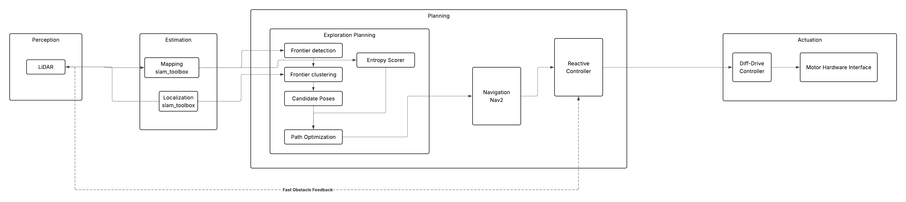
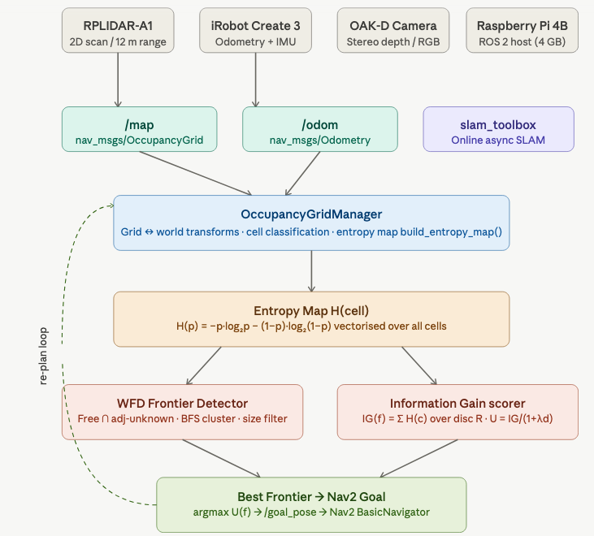

# Milestone 2: Yalo Mobile Robot 

{: .no_toc }

This page demonstrates the core capabilities of the Just the Docs theme, including navigation, mathematical typesetting, and technical diagrams.

---

## Table of Contents

{: .no_toc .text-delta }

1. TOC
{:toc}

---

## 1. Kinematics

The TurtleBot is controlled using velocity commands published to the `/cmd_vel` topic:

$$
\mathbf{u} =
\begin{bmatrix}
v \\
\omega
\end{bmatrix}
=
\begin{bmatrix}
\text{linear.x} \\
\text{angular.z}
\end{bmatrix}
$$

The robot pose is defined as:

$$
\mathbf{x} =
\begin{bmatrix}
x \\
y \\
\theta
\end{bmatrix}
$$

### Continuous-Time Motion Model

$$
\begin{aligned}
\dot{x} &= v \cos\theta \\
\dot{y} &= v \sin\theta \\
\dot{\theta} &= \omega
\end{aligned}
$$

### Discrete-Time Motion Model

$$
\begin{aligned}
x_{k+1} &= x_k + v_k \cos\theta_k \Delta t \\
y_{k+1} &= y_k + v_k \sin\theta_k \Delta t \\
\theta_{k+1} &= \theta_k + \omega_k \Delta t
\end{aligned}
$$

---

## 2. System Architecture

Mermaid Diagram

---

### Module Descriptions

#### Frontier Detection Using BFS Clustering

#### Overview

This module implements frontier-based exploration for a mobile robot using an occupancy grid map. It consists of four main functions:

- `is_frontier_cell`
- `grow_frontier`
- `find_frontiers`
- `frontier_centroid`

The goal is to detect frontier regions (boundaries between known and unknown space), group them into clusters using BFS, and compute a centroid for navigation and scoring.

---

#### Occupancy Grid Definition

Each map cell \( c(x,y) \) has a value:

- \( c = -1 \) → Unknown  
- \( c = 0 \) → Free space  
- \( c > 0 \) → Occupied / obstacle  

---

#### 1. Frontier Cell Detection

#### Function:
`is_frontier_cell(grid, x, y, width, height)`

#### Purpose:
Determines whether a given grid cell is a **frontier cell**.

#### Definition:

A cell is a frontier if:

1. It is free:
$$
c(x,y) = 0
$$

2. At least one neighbor is unknown:
$$
\exists (i,j) \in \mathcal{N}(x,y) \text{ such that } c(i,j) = -1
$$

### Formal definition:

$$
F(x,y) =
\begin{cases}
1, & \text{if } c(x,y)=0 \land \exists n \in \mathcal{N}(x,y), c(n)=-1 \\
0, & \text{otherwise}
\end{cases}
$$

### Output:
- `True` → cell is a frontier
- `False` → not a frontier

---

#### 2. Frontier Clustering (BFS Growth)

#### Function:
`grow_frontier(grid, start, visited, width, height)`

#### Purpose:
Expands a single frontier cell into a full **connected frontier cluster** using BFS.

---

#### Algorithm:

Starting from a seed cell \( s \):

1. Add \( s \) to a queue
2. Expand to neighboring frontier cells
3. Mark visited cells
4. Stop when:
   - no more connected frontier cells exist, OR
   - cluster reaches maximum size

---

#### Maximum Cluster Constraint:

To prevent excessive growth:

$$
|C| \leq 600
$$

If cluster size reaches 600, BFS stops expanding.

---

#### Cluster Definition:

A frontier cluster \( C \) is:

$$
C = \{ f_1, f_2, ..., f_n \}
$$

where all cells are:
- frontier cells
- connected through 4 or 8-neighbor connectivity

---

#### 3. Full Frontier Detection Pipeline

#### Function:
`find_frontiers(map_msg, robot_cell)`

#### Purpose:
Finds all frontier clusters in the map using BFS expansion from the robot’s position.

---

#### Steps:

1. Convert occupancy grid into 2D array:
$$
G \in \mathbb{R}^{H \times W}
$$

2. Start BFS from robot cell \( r \)

3. Expand through free space:
$$
c(x,y) \in [0, 10]
$$

4. Detect frontier cells using `is_frontier_cell`

5. For each frontier cell:
   - call `grow_frontier`
   - form cluster \( C_i \)

6. Filter clusters:
$$
|C_i| \geq 8
$$

7. Store valid clusters:
$$
\mathcal{F} = \{ C_1, C_2, ..., C_n \}
$$

---

#### Output:

A list of frontier clusters:

$$
\mathcal{F} = [C_1, C_2, ..., C_n]
$$

Each cluster contains:
- frontier cells
- spatial structure
- connectivity information

---

#### 4. Centroid Computation

#### Function:
`frontier_centroid(frontier)`

#### Purpose:
Computes a representative navigation point for a frontier cluster.

---

#### Definition:

Given a cluster:

$$
C = \{ (x_1,y_1), (x_2,y_2), ..., (x_n,y_n) \}
$$

The centroid is:

$$
\bar{x} = \frac{1}{n} \sum_{i=1}^{n} x_i
$$

$$
\bar{y} = \frac{1}{n} \sum_{i=1}^{n} y_i
$$

---

#### Output:

The centroid:

$$
\mathbf{p}_c = (\bar{x}, \bar{y})
$$

---

#### Why Centroid Is Used

The centroid is used because:

- It compresses a large cluster into a single goal
- It is efficient for navigation (Nav2 goal)
- It simplifies entropy and decision-making steps

Note:
The centroid is not necessarily a frontier cell itself.

---

#### Summary of Functions

| Function | Role |
|----------|------|
| `is_frontier_cell` | Detects if a cell is a frontier |
| `grow_frontier` | BFS expansion into a cluster (max size 600) |
| `find_frontiers` | Finds all frontier clusters from robot position |
| `frontier_centroid` | Computes navigation goal from cluster |

---

#### Final Pipeline

$$
\text{Map} \rightarrow \text{Frontier Cells} \rightarrow \text{BFS Clusters} \rightarrow \text{Centroids} \rightarrow \text{Entropy Selection} \rightarrow \text{Navigation Goal}
$$

#### Entropy Exploration Algorithm 
The real world is very dynamic and mobile robots inhabit and share the same spaces as humans, encountering moving cars, people, trains, 18-wheelers, strollers, street traffic barricades, construction, daily and numerous human activities. Even inside the home in the living room, humans don't always take the same path to go to the kitchen, moving unpredictably to the left or to the right to go to the same point A to point B in the same room or between rooms. In another scenario let’s take into consideration the static frame, NASA Lunar rover navigating the Lunar Regolith Terrain (LRT). Here in the space exploration Moon rovers, which is completely new, which doesn’t have a map, there is a challenge for mobile robots to move around. Mobile robots need to be provided with a map of the environment it is moving on. In both these scenarios of NASA Lunar rover which has completely new landscape, orientation, craters, rocks, mountains, vast basins all unique as human has not inhabited moon to take its map, and the scenario of living room during superbowl Game or just say the Mobile Robot Lab with crowd of high school students coming to watch the mobile robots will have some sort of unique obstacles of energetic dynamic moving high school students. To navigate our Yalo mobile robot in this unique environment it is quite a challenge. To simplify, the dynamic movement of high school students freezes the frame during the most crowded time of students moving from the hallway to our Mobile robot lab. If we have our Yalo mobile robot to navigate in this hallway, which is a new environment to it and say we haven’t provided the map to navigate Yalo mobile robot in this hallway.

This is where our Entropy Exploration Algorithm comes into play to navigate our Yalo mobile robot by autonomously mapping the new hallway calculating “Frontiers” then selecting the most informative path to reach the destination elevator, moving through the hallway from the Mobile lab.

Entropy Exploration Algorithm takes the Frontier captured and calculated and the algorithm provides the number from -1 to 100. 

     -1   → Unknown   → p ≈ 0.50  → H ≈ 1.00 bit  (max entropy)
      0   → Free      → p ≈ 0.05  → H ≈ 0.29 bit
    100   → Occupied  → p ≈ 0.95  → H ≈ 0.29 bit

The grouping of the Frontier is done and this cluster is used for the efficiency and with the Information-gain selects the best suitable Frontier so that YALO navigates using that selected best suitable Frontier moving towards the target. 

{: width="500" }

*Figure: Architecture diagram of Entropy Exploration algorithm in YALO mobile robot*

─────────────────────────────────────────────
#### Shannon Binary Entropy per Cell

The binary entropy of a cell with occupancy probability is defined as:

\begin{equation}
    H(p) \;=\; -p \log_2 p \;-\; (1 - p)\log_2(1 - p)
\end{equation}

Unknown cells (value -1) map to p=0.5 → H=1.0 bit (maximum uncertainty). The entire grid is vectorised with NumPy — no Python loops over cells.
─────────────────────────────────────────────
#### Information Gain at Frontier Viewpoint

For a candidate viewpoint, the information gain is the sum of entropies over all
cells within a sensor disc of radius R sensor:

\begin{equation}
    \mathrm{IG}(v) \;=\; \sum_{c \,\in\, \mathrm{Disc}(v,\, R_{\text{sensor}})} H(c)
\end{equation}

Integration over a circular disc of radius R=6m (RPLIDAR-A1 range), using an efficient NumPy slice + circular boolean mask — O(R²) not O(W·H).

─────────────────────────────────────────────
#### Distance-Weighted Utility (Elfes-Style)

The utility of a frontier balances information gain against travel cost:

\begin{equation}
    U(f) \;=\; \frac{\mathrm{IG}(f)}{1 \;+\; \lambda\, d(\text{robot},\, f)}
\end{equation}

This balances information gain (exploration breadth) against travel cost. λ=0.35 is tunable via ROS parameter.
─────────────────────────────────────────────
#### Three Key Modules
OccupancyGridManager — wraps nav_msgs/OccupancyGrid with world↔grid coordinate transforms, cell classification (is_free, is_unknown, is_occupied), and the entropy integration disc query.

detect_frontiers() — Wavefront Frontier Detector (WFD): vectorised free/unknown masks → 8-connected shift operations → BFS clustering → size filtering. No Python cell loops in Step 1.

score_frontiers() — calls information_gain_at() per frontier centroid, computes utility, returns list sorted descending by U(f).

## 3. Experimental Analysis & Validation

### Noise & Uncertainty Analysis

Sensor calibration was primarily handled at the hardware and driver level, with minimal manual tuning required for this project. The LiDAR and odometry sensors on the TurtleBot 4 were assumed to be pre-calibrated by the platform.

To ensure reliable operation, basic validation was performed by checking consistency between the `/scan` and `/tf` frames, as well as verifying that the occupancy grid generated by SLAM Toolbox aligned correctly with the robot’s observed motion.

Minor parameter tuning was applied to reduce the impact of sensor noise and improve stability during mapping. This included adjusting filtering thresholds and ensuring proper frame synchronization between localization and mapping components.

### Run-Time Issues

We have some problems with 

### Milestone Video
https://youtu.be/2M4OItG_boE

---

## 4. Project Management

Instructor Feedback Integration: 'Markdown kitchen sink' is now remove and title of the webpage is updated. https://achyutsun.github.io/yalo/ 

Individual Contribution: 
| Team Member | Primary Technical Role | Key Git Commits/PRs | Specific File(s) Authorship (Direct Links)                   |
|:------------|:----------------------:|:-------------------:|-------------------------------------------------------------:|
| Long        | Frontier Detection     | [Commit `d5576ca`]  | `frontier.rviz`, `frontier_utils.py`, `frontier_detector.py` |
| Yibo        | Decision Making        | [Commit `80ae368`]  | `frontier_detector.py`, `decision_maker.py`                  |
| Achyut      | Entropy Exploration    | [Commit `41ecafd`]  | `entropy_explorer.py`                                        |

---

## 5. Submission Checklist

* [x] Complete Markdown documentation
* [x] Verify LaTeX rendering
* [x] Generate Mermaid flowchart
* [ ] Peer review feedback

# Markdown Features

## Callouts
> This is a note
{: .note }

> This is a warning
{: .warning }

## Buttons
[Main Button](assignment1.html){: .btn .btn-primary }
[Blue Button](assignment2.html){: .btn .btn-blue }
[Blue Button](assignment3.html){: .btn .btn-red }

## Tables

| Header | Header |
| :--- | :--- |
| Cell | Cell |

---
