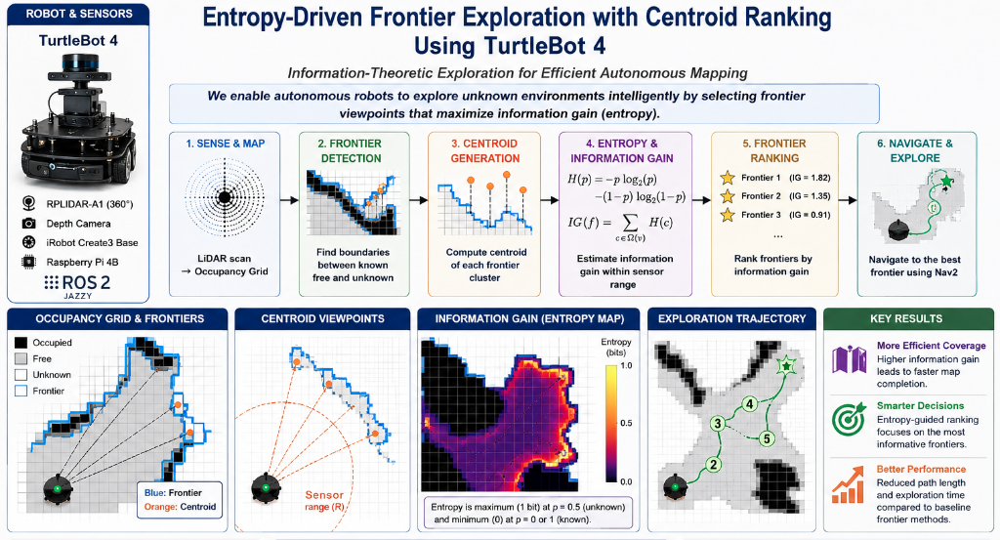
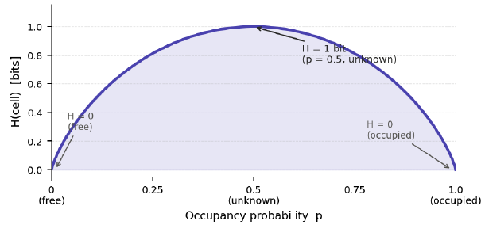
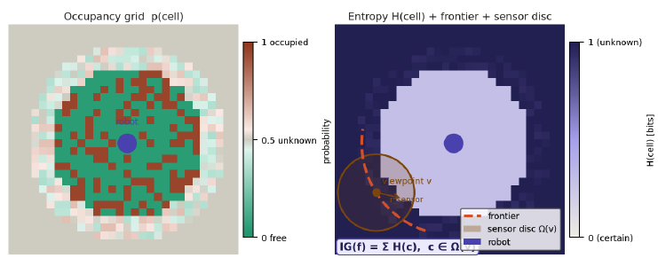
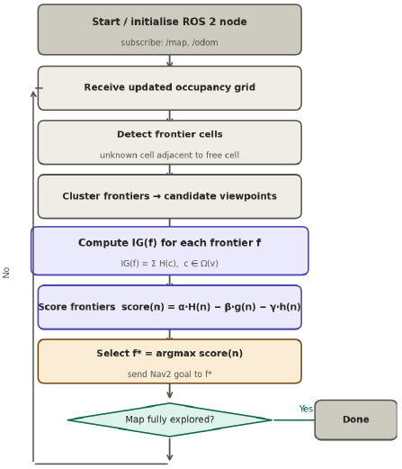

# Milestone 3: Yalo Mobile Robot      

Team members: Yibo @JerrySyameimaru, Achyut @achyutsun, Long @lhtruong26   
<https://www.yalo.space>

Arizona State University RAS-598 Mobile Robotics Class  Spring, 2026

Professor: Vivek Thangavelu, PhD               

{: .no_toc }

This report presents the final system design, evaluation, and analysis of the Yalo Mobile Robot project.

---

## Table of Contents

{: .no_toc .text-delta }

1. TOC
{:toc}

---

## 1. Project Overview


Topics to include:

- Project motivation
- Exploration objectives
- Autonomous navigation goals
- System capabilities
- Final mission summary

---

## 2. Graphical Abstract




---

## 3. System Architecture

Overview of the complete robot software and hardware pipeline.

RQT graph


---

## 4. Algorithm

Description of the core algorithms used in the project.

### 4.1 Robot Kinematics

Basic robot motion model and control equations.

$$
\mathbf{x} =
\begin{bmatrix}
x \\
y \\
\theta
\end{bmatrix}
$$

$$
\mathbf{u} =
\begin{bmatrix}
v \\
\omega
\end{bmatrix}
$$

---

### 4.2 Frontier Detection

Overview of frontier-based exploration and BFS clustering.

Frontier Cluster Centroid Calculation

Given a frontier cluster containing \(N\) frontier cells:

$$
\{(x_1, y_1), (x_2, y_2), \dots, (x_N, y_N)\}
$$

the centroid position is computed as the arithmetic mean of all frontier cell coordinates.

Centroid Equations

$$
x_c = \frac{1}{N} \sum_{i=1}^{N} x_i
$$

$$
y_c = \frac{1}{N} \sum_{i=1}^{N} y_i
$$

where:

$$
(x_c, y_c)
$$

is the centroid position of the frontier cluster.

Expanded Form

$$
x_c = \frac{x_1 + x_2 + \cdots + x_N}{N}
$$

$$
y_c = \frac{y_1 + y_2 + \cdots + y_N}{N}
$$

Exploration Usage

The centroid represents the geometric center of a frontier cluster and is used as the navigation target for autonomous exploration.

Larger frontier clusters are typically prioritized because they correspond to larger unexplored regions.

Goal Yaw Computation

The robot computes the yaw angle so it faces the selected frontier centroid.

$$
\Delta x = x_g - x_r
$$

$$
\Delta y = y_g - y_r
$$

$$
\theta = \text{atan2}(y_g - y_r,\ x_g - x_r)
$$

Where:

$$
x_r,\ y_r = \text{robot position}
$$

$$
x_g,\ y_g = \text{goal position}
$$

$$
\theta = \text{goal yaw angle}
$$

The yaw is converted into quaternion form:

$$
q_z = \sin\left(\frac{\theta}{2}\right)
$$

$$
q_w = \cos\left(\frac{\theta}{2}\right)
$$

Final quaternion:

$$
(q_x, q_y, q_z, q_w)
=
(0, 0, \sin(\theta/2), \cos(\theta/2))
$$

---

### 4.3 Entropy Exploration

Overview of entropy-based frontier scoring.
Yalo Mobile robot uses an entropy-maximising frontier exploration algorithm deployed on the TurtleBot4 mobile platform under ROS 2 Jazzy. The method assigns each candidate frontier an information-gain score derived from Shannon occupancy-grid entropy and selects navigation goals that maximally reduce map uncertainty. A composite ranking function balances exploration drive, path cost, and goal proximity, recovering weighted A* and pure entropy-greedy search as special cases. The algorithm runs as a single ROS 2 lifecycle node, subscribing to /map and /odom and publishing Nav2 goals.

#### 4.3.1. Mathematical Foundation

##### 4.3.1.1 Cell Entropy

  Each cell in the 2-D occupancy grid stores a probability `p ∈ [0, 1]` representing the likelihood of occupancy. The binary Shannon entropy of a single cell is:

```
H(cell) = −p · log₂(p) − (1−p) · log₂(1−p)
```

`H` is maximised at `p = 0.5` (the cell is completely unknown, contributing 1 bit of uncertainty) and collapses to zero at `p = 0` (certainly free) or `p = 1` (certainly occupied). Figure 1 plots this relationship.

> **Figure 1** — Binary entropy H(cell) vs occupancy probability p.

##### 4.3.1.2 Information Gain of a Frontier

  Given a candidate frontier `f` with associated viewpoint `v`, the sensor footprint `Ω(v)` is the set of grid cells within the RPLIDAR-A1 maximum range `r_sensor` centred on `v`. The expected information gain is approximated by summing cell entropy over this disc:

  ```
  IG(f) = Σ_{c ∈ Ω(v)}  H(c)
  ```

  This is a tractable proxy for the true expected posterior entropy reduction. Cells already known (`H ≈ 0`) contribute negligibly; high-entropy unknown cells dominate the sum, steering the robot toward genuinely uncertain regions.

  > **Figure 2** — Occupancy grid (left) and entropy map with frontier selection (right). The frontier band is highlighted in deep purple; the orange disc shows the sensor footprint Ω(v) at the selected viewpoint.
  

#### 4.3.2. System Architecture

  The algorithm runs as a single **ROS 2 Jazzy lifecycle node** on the TurtleBot4's Raspberry Pi 4B. It subscribes to the Nav2 costmap (`/map`) and odometry (`/odom`), and publishes navigation goals via the Nav2 action server. Figure 3 illustrates the control loop.

  > **Figure 3** — Control loop (TurtleBot4 / ROS 2 Jazzy).

#### 4.3.3. Parameters and Tuning

  | Parameter | Symbol | Default | Effect |
  |---|---|---|---|
  | Entropy weight | α (alpha) | 1.0 | Higher → more exploration drive |
  | Path cost weight | β (beta) | 0.5 | Higher → prefers nearby frontiers |
  | Heuristic weight | γ (gamma) | 0.5 | Higher → goal-directed bias |
  | Sensor radius | r_sensor | 3.5 m | RPLIDAR-A1 effective range |
  | Min frontier size | — | 5 cells | Filters noise clusters |


#### 4.3.4 What we did

  We described an entropy-maximising frontier exploration algorithm for the TurtleBot4. By grounding frontier selection in Shannon information theory, the approach provides a principled, interpretable criterion for navigation goal selection. The composite scoring function unifies entropy-greedy and cost-aware strategies through tunable weights, and the implementation integrates directly with the ROS 2 Nav2 stack. Future work will extend the sensor model to account for angular resolution and occlusion, and evaluate coverage completeness against nearest-frontier and random baselines on physical hardware.

---

### 4.4 Decision Making

The decision stage is responsible for turning the frontier set into a single navigation target. In the current implementation, the decision maker reuses the frontier detection and entropy scoring pipeline from `entropy_explorer.py`, then applies an additional motion-cost model before sending the final goal to Nav2. This keeps the exploration behaviour consistent: the robot prefers frontiers with high information gain, but it also avoids goals that are expensive, unstable, or poorly aligned with the current robot heading.
### 4.4.1 Mathematical Framework

All decision logic is built on four core equations. Here is the complete mathematical model:

**Equation 1: Entropy Utility**

Each frontier is scored by its information gain (computed in `entropy_explorer.py`) and distance-weighted utility:

$$U(f) = \frac{IG(f)}{1 + \lambda \cdot d(robot, f)}$$

where:
- $$IG(f)$$ is the information gain around the frontier centroid (bits),
- $$d(robot, f)$$ is the Euclidean distance from robot to frontier centroid (metres),
- $$\lambda$$ is the distance decay factor (≈ 0.35).
- **The +1:** ensures non-zero denominator and normalises baseline behaviour (frontiers at d=0 have utility = IG).

The numerator rewards high-information frontiers; the denominator penalises distance, balancing exploration breadth against travel cost.

**Equation 2: Motion Cost**

The motion cost estimates the effort required to navigate to a frontier:

$$C(f) = C_{base} + w_v \cdot d(robot,f) + w_\omega \cdot |\Delta\theta| + C_{startup}$$

where:
- $$C_{base}$$ is a constant baseline cost for robot operation (e.g., 0.05),
- $$w_v$$ is the linear cost weight per metre (e.g., 1.0),
- $$d(robot,f)$$ is the Euclidean distance to the frontier,
- $$w_\omega$$ is the angular cost weight per radian (e.g., 0.6),
- $$|\Delta\theta|$$ is the absolute heading error (angle to rotate toward the frontier),
- $$C_{startup}$$ is an optional penalty (e.g., 0.35) applied when the robot starts from near-rest and must travel distance $$> 0.25 \text{ m}$$.

This formula models realistic navigation effort: static overhead, linear travel cost, rotation effort, and acceleration penalty.

**Equation 3: Normalisation**

Since $$U(f)$$ and $$C(f)$$ have different units and scales, they are normalised to [0, 1] for fair comparison:

$$\tilde{U}(f) = \frac{U(f)}{\max_i U(f_i)}, \quad \tilde{C}(f) = \frac{C(f)}{\max_i C(f_i)}, \quad \tilde{d}_{prev}(f) = \frac{d_{prev}(f)}{\max_i d_{prev}(f_i)}$$

where $$d_{prev}(f)$$ is the distance from frontier $$f$$ to the previously published goal (for consistency tracking).

**Equation 4: Final Score (Decision Rule)**

The normalised metrics are combined via weighted linear aggregation to produce a final utility score:

$$S(f) = w_{ent} \cdot \tilde{U}(f) - w_{cost} \cdot \tilde{C}(f) - w_{cons} \cdot \tilde{d}_{prev}(f)$$

where:
- $$w_{ent}$$ is entropy weight (default 1.0; increase for aggressive exploration),
- $$w_{cost}$$ is motion cost weight (default 0.55; increase for conservative, efficient paths),
- $$w_{cons}$$ is consistency weight (default 0.45; increase to prefer stability over novelty).

The frontier with the maximum score is selected as the next navigation target

**Interpretation:**
- Higher $$\tilde{U}(f)$$ (more informative) → **higher score** (positive term).
- Higher $$\tilde{C}(f)$$ (more costly) → **lower score** (negative term).
- Farther from previous goal (less consistent) → **lower score** (negative term).

The weights balance these three objectives: information gain, motion efficiency, and goal stability.

### 4.4.2 Stability Mechanisms

After ranking, the decision maker applies hysteresis and goal-matching to prevent oscillation:

- **Hysteresis:** If the best frontier does not improve the score by at least `switch_margin` (default 0.15), the previous goal is retained.
- **Same-goal tolerance:** If the new best frontier is within `same_goal_tolerance` (default 0.2 m) of the last published goal, the update is skipped to avoid redundant replanning.

These mechanisms ensure smooth, stable exploration without excessive goal switching.

### 4.4.3 Goal Updates

The final navigation target is published only after the best frontier survives ranking, motion-cost evaluation, and hysteresis. The selected centroid is then sent to Nav2 through `/goal_pose`. If the robot is already navigating and the new target is too similar to the previous one, the update is skipped to avoid redundant replanning.

The goal update process therefore follows this sequence:

1. Detect frontier clusters from the map.
2. Rank them by entropy utility.
3. Apply motion-cost and safety checks.
4. Choose the highest-scoring forward-facing target.
5. Publish the goal to Nav2.

This approach keeps the exploration policy information-driven while still respecting motion effort, consistency, and runtime safety.

---

## 5. Benchmarking & Results

Evaluation of system performance during final mission execution.

### 5.1 Accuracy

During experimental testing, the robot’s estimated trajectory in RViz remained closely aligned with the observed robot motion in the simulation environment. The navigation system was able to follow planned paths consistently while maintaining stable localization throughout exploration.

---

### 5.2 Success Rate

Performance evaluation across multiple trials.

| Trial | Result | Notes |
|------|------|------|
| 1 | Fail | Goal sent to Nav2 rejected |
| 2 | Fail | Robot frozen trying to move backward |
| 3 | Fail | Robot frozen trying to move backward |
| 4 | First time navigate. Fail in the end | Hit the pillar and get stuck |'
| 5 | Second time navigate. Fail in the end | Drive under a desk and can not get out. Bad goal chosen |
| 6 | Third time navigate. Fail in the end | Drive under a desk and can not get out. Bad goal chosen |
| 7 | Fourth time navigate. Fail in the end | Drive under a desk and can not get out. Bad goal chosen |
| 8 | Fifth time navigate. Fail in the end | Drive into obstacles and can not get out |
| 9 | Success | Robot continouously pick goal and update map |
| 10 | seventh time navigate. Fail in the end | Drive into obstacles and can not get out|


---

### 5.3 Final Mission Video

https://youtu.be/D1sxXO-z0Kw

---

## 6. Ethical Impact Statement


The Yalo project is a LiDAR-based frontier exploration system that detects unknown boundaries in an occupancy grid and converts them into navigation goals. Even in its current form, the project raises ethical concerns because data handling, motion control, and sensor interpretation directly affect safety, privacy, and fairness.

Privacy risks are limited because the system mainly uses LiDAR, map, and odometry data instead of raw imagery. However, map and pose history can still reveal occupancy patterns and sensitive spatial behavior. If future versions add RGB cameras or richer logging, on-device processing or redaction should be used before storage or transmission. The ethical baseline should remain data minimization.

Safety is the most immediate concern because the robot autonomously selects movement goals in physical environments. The robot should slow near uncertain frontiers, reduce speed when localization confidence drops, and stop safely if localization or map updates become unreliable. Slightly slower exploration is justified if it reduces collisions or injuries.

Bias appears mainly as hardware bias. LiDAR performs inconsistently on glass, reflective surfaces, thin obstacles, and some environments, so the same robot may work well in one space and poorly in another. A fair design would acknowledge these limits and expose confidence estimates instead of assuming equal performance everywhere.

**Utilitarian Test:**
The project’s main benefit is efficient autonomous exploration for mapping and navigation. The main risks come from sensor blind spots, overconfident motion, and unnecessary data retention. The ethical design maximizes safe exploration while minimizing harm through conservative speed limits and fail-safe stopping.

**Justice Test:**
Because LiDAR performance depends on the environment, some users and spaces face greater risk than others. Future versions should document limitations and evaluate performance across different environments.

**Virtue Test:**
A responsible robotics team should avoid overstating LiDAR reliability and remain transparent about system limitations. The virtuous design is cautious, honest about uncertainty, and respectful of human spaces.


---

## 7. Custom Module Code Links

Links to the major custom modules and key commits used in the project.

| Team Member | Role | Key Git Commit/PR | Specific File(s) Authorship |
|-------------|------|-------------------|-----------------------------|
| Long | Frontier Detection | [Commit `3e16e52`](https://github.com/achyutsun/yalo/commit/3e16e5286a90064b700cd73995bb48dfda37b952), [Commit `dc94748`](https://github.com/achyutsun/yalo/commit/dc94748bc9f528b322d3067ee45ef9dc1222fc8b), [Commit `322e477f`](https://github.com/achyutsun/yalo/commit/22e477fca71f92b16618a68f7a42ac8a4d7c14eb)  | `frontier_detector.py`, `frontier_utils.py`, `navigation.py` |
| Yibo | Decision Making | [Commit `cc44e18`](https://github.com/YOUR-REPO/commit/cc44e18) | `decision_maker.py` |
| Achyut | Entropy Exploration | [Commit `defd9b7`](https://github.com/YOUR-REPO/commit/defd9b7) | `entropy_explorer.py` |


---

## 8. Experimental Analysis

Discussion of experimental observations and validation.

- Time synchronization mismatch caused TF lookup failures and unstable transform updates between frames.
- Sensor data remained stable throughout testing, with LiDAR and odometry publishing consistently.
- SLAM mapping performed successfully and generated a usable occupancy grid map during exploration.
- Nav2 frequently failed during startup because controller_server could not establish a bond with the lifecycle manager within the timeout period, causing the navigation stack bringup to abort.
- The robot experienced restricted backward motion and occasionally froze when reverse movement was required.
- The robot could become stuck in narrow or tight spaces due to limited maneuvering room and local planner constraints.
- Navigation performance was less stable in cluttered environments with many nearby obstacles.
- Frontier exploration occasionally selected goals near difficult or partially blocked regions, leading to inefficient recovery behavior.
- Recovery behavior sometimes increased navigation time due to repeated replanning and obstacle avoidance attempts.

---

## 9. References
**[1]** Thrun, S., Burgard, W., & Fox, D. (2005).
**Probabilistic Robotics.**
MIT Press, Cambridge, MA.
*Foundational reference for occupancy grids, Bayesian filtering, SLAM, and entropy-based uncertainty estimation.*

---

**[2]** Elfes, A. (1989).
**Using Occupancy Grids for Mobile Robot Perception and Navigation.**
*IEEE Computer*, 22, 46–57.
*Seminal occupancy-grid mapping framework underpinning frontier exploration and entropy calculations.*

---

**[3]** Keidar, M., & Kaminka, G. (2014).
**Efficient Frontier Detection for Robot Exploration.**
*The International Journal of Robotics Research (IJRR)*, 33, 215–236.

---

**[4]** Yu, Y., & Gupta, K. (2004).
**C-space Entropy: A Measure for View Planning and Exploration for General Robot-Sensor Systems in Unknown Environments.**
*The International Journal of Robotics Research (IJRR)*, 23, 1197–1223.
*Introduces entropy reduction as a formal exploration objective.*

---

**[5]** Wang, P., & Gupta, K. (2007).
**View Planning for Exploration via Maximal C-space Entropy Reduction for Robot Mounted Range Sensors.**
*Advanced Robotics*, 21, 771–792.

---

**[6]** Li, P., et al. (2020).
**A High-Efficiency, Information-Based Exploration Path Planning Method for Active Simultaneous Localization and Mapping.**
*International Journal of Advanced Robotic Systems*, 17, 1–14.
*Proposes entropy-map-driven active SLAM exploration.*

---

**[7]** Yamauchi, B. (1997).
**A Frontier-Based Approach for Autonomous Exploration.**
In: *Proceedings of the IEEE International Symposium on Computational Intelligence in Robotics and Automation (CIRA)*, pp. 146–151.
*Landmark paper introducing frontier-based exploration.*

---

**[8]** Mozos, O. M., et al. (2007).
**Supervised Semantic Labeling of Places Using Information Extracted from Sensor Data.**
*Robotics and Autonomous Systems*, 55, 391–402.
*Early probabilistic environment modeling for exploration.*

---
